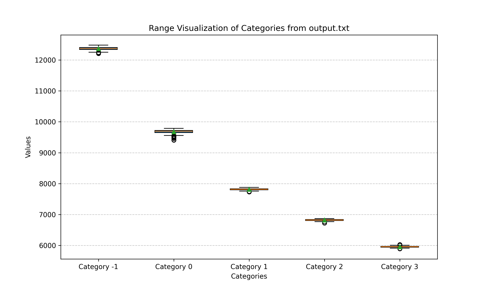

# CS773 Assignment 1

Refer [this](https://docs.google.com/document/d/1a77P4xrjjIW19FLUkyICbp5-0GycmheJxvPIxOFUmTA/edit?usp=sharing) link to understand the problem statement

## Submission Details
Name and roll numbers of the team members.

## Task 2A
### Approach
Our approach for Task 2A involves a covert channel communication using cache timing side-channels. The sender encodes binary data as a sequence of memory accesses and flushes, while the receiver measures access times to infer the transmitted bits.

1. **Bit Stream Extraction**: We first read the input file (`msg.txt`) as a binary stream and convert each byte into a sequence of bits.
2. **Synchronization**: We use a predefined magic sequence (`101010`) at regular intervals to synchronize the sender and receiver.
3. **Transmission Mechanism**: 
   - For a bit `1`, the sender repeatedly accesses shared memory locations within a time slot.
   - For a bit `0`, the sender remains idle.
4. **Receiving Mechanism**:
   - The receiver monitors the shared memory and measures access times.
   - A high access time indicates a `1` (miss due to cache flush), while a low access time indicates a `0` (hit due to cache presence).
5. **Chunking and Synchronization**:
   - Data is transmitted in chunks, ensuring synchronization between sender and receiver every `CHUNK_SIZE` bits.
   - The receiver detects synchronization patterns before decoding the incoming bits.
6. **Final Output**:
   - The received bits are reassembled into bytes and stored in an output file (`received.txt`).

This approach exploits shared memory and cache-based timing differences for covert data transmission while ensuring minimal interference and robust synchronization.

### Results
- **Accuracy:** **100%**
- **Bandwidth:** **119bps**

You can also mention accuracy vs bandwidths that you observed while tuning.

## Task 2B
### Task 2B - Approach  

In this task, we implement an **occupancy-based covert channel** to transmit data from Raj to Simran without any shared memory between sender and receiver.  

#### **Overview**  
We utilize **cache thrashing** at different levels to encode information. The sender modulates its activity to create distinguishable cache occupancy patterns, while the receiver monitors execution times to infer the transmitted bits.  

#### **Encoding Scheme**  
We define **five levels of cache thrashing**, corresponding to different data encodings:  

| Thrashing Level | Encoding |
|----------------|----------|
| 0.0 (0%)      | No data transfer |
| 0.15 (15%)    | `00` |
| 0.4 (40%)     | `01` |
| 0.6 (60%)     | `10` |
| 1.0 (100%)    | `11` |

#### **Steps**  

1. **Calibration:**  
   - A script runs at each thrashing level to measure execution time cycles.  
   - The results are used to train a **Decision Tree ML model** for classification.  

2. **Encoding & Transmission:**  
   - The sender **encodes the data** into one of the thrashing levels (`0, 1, 2, 3`).  
   - It **modifies cache activity** accordingly to send the encoded information.  

3. **Reception & Decoding:**  
   - The receiver **monitors execution times** to determine the thrashing level.  
   - The pre-trained **ML model classifies** the received patterns into one of the levels (`0-3`).  
   - The detected levels are then **decoded back** into the original bit and the original message is reconstructed.

This approach ensures successful transmission while balancing **bandwidth and error rate requirements**.

### Results
- **Accuracy:** **100%**
- **Bandwidth:** **6.59bps**
- 

## **Task 3**  

### **Approach**  
In **Task 3**, we combine two covert channel techniques:  

1. **Occupancy-based Attack** (from Task 2B) to share the **name of the shared file** between sender and receiver.  
2. **Flush + Reload Attack** (similar to Task 2A) to transmit the actual **target file** (a heart image) using shared memory.  

The steps are as follows:  

1. **Establish Covert Communication:**  
   - The sender uses **cache occupancy variations** to transmit the filename of the shared memory file.  
   - The receiver detects and decodes this filename using pre-calibrated thresholds.  

2. **Use the Received Filename for Shared Memory:**  
   - Once the receiver gets the filename, it maps the shared memory to the same file.  

3. **Execute Flush + Reload Attack:**  
   - The sender writes the image file (heart image) into the shared memory.  
   - The receiver retrieves the image using **cache flush and reload** techniques.  

### **Why Not Use Occupancy to Send the Heart Image?**  
Occupancy-based channels are **slower and noisier**, making them **unsuitable for large data transmission**. Instead, **Flush + Reload** is used after learning the filename, as it provides **higher accuracy and better bandwidth** for transferring the image efficiently.

### Results
#### Image Transmission
- **Sent Image:** *(Provide the image file name or attach the image)*
- **Received Image:** *(Provide the image file name or attach the image)*
- **Time taken:** How long did it take for the transmission.

#### Audio Transmission
- **Sent Audio:** *(Provide the audio file name or attach the audio)*
- **Received Audio:** *(Provide the audio file name or attach the audio)*
- **Time taken:** How long did it take for the transmission.

## Plagiarism Checklist
Your answers should be written in a new line below each bullet.

1. Have you strictly adhered to the submission guidelines?

2. Have you received or provided any assistance for this assignment beyond public discussions with peers/TAs?

3. If you answered "yes" to the previous question, please specify what part of code you've taken and from whom you've taken it.

## Directory Structure
Folders - `task2a`, `task2b`, `task3a` and optionally `task3b`. Each of these directories should contain:

1. `sender.c`
2. `receiver.c`
3. `utils.c`
4. `utils.h`
5. `MakeFile`
6. Additional relevant files

If the implementation for `task3a` and `task3b` is the same, put the code in the folder `task3a`. Apart from the above folders, there should be a completely filled README file.

Your submission should be `zip` file with <roll-number>.zip. Only one team member should submit, else there will be penalties.
