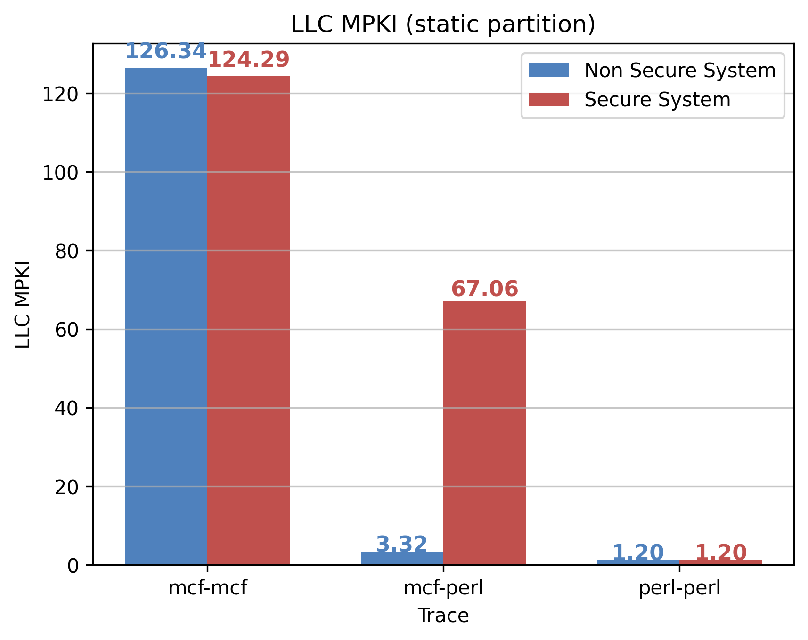

<!-- ! THIS IS AUTOGENERATED DO NOT EDIT THIS. EDIT Report.template.md -->
# Programming Assignment 2 Report

## CS 773: Computer Architecture for Performance and Security, Spring 2025  
**Indian Institute of Technology, Bombay**  

### Team Members:  
- **Arif Ali** (23m0822)  
- **Soumik Dutta** (23m0826)  
- **Arnab Bhakta** (23m0835)  

---

## Git Repository
[Repository Link: **[PA2](https://github.com/sammagnet7/cs773_CompArch-Perf-Security/tree/main/PA2)**]

## Traces
[Drive link: **[Download](https://drive.google.com/drive/folders/11hoH9rfdehELjpHH7bCtuMuREtSzICmy?usp=drive_link)**]

---

### Experiment Details

#### Explanation of Table Columns:
- **Policy**: Cache partition policy used i.e. Base(No partition), Way, Static, Dynamic.
- **trace**: Workload i.e. mcf-mcf, mcf-perl, perl-perl.
- **ipc_core0**: Instructions executed per cycle by core 0.
- **ipc_core1**: Instructions executed per cycle by core 1.
- **ipc_total**: `ipc_core0 + ipc_core1`.  
- **normalized_ipc**: `new_ipc_total / base_ipc_total`
- **mpki_core0**: LLC Cache misses per 1000 instructions for core 0.
- **mpki_core1**: LLC Cache misses per 1000 instructions for core 1.
- **mpki_avg**: `(mpki_core0 + mpki_core1) / 2`.  
- **evictions_core0**: LLC Self eviction by core 0.
- **evictions_core1**: LLC Self eviction by core 1.
- **evictions_total**: `evictions_core0 + evictions_core1`.  
- **total_instruction_executed**: `50M` (core0) + `50M` (core1) = `100M`
- **EPKI (Evictions per kilo instructions)**:  `(evictions_total / total_instruction_executed) * 1000`

#### Base Data
<table border="1">
    <thead>
        <tr>
            <th rowspan="2">Policy</th>
            <th rowspan="2">Trace</th>
            <th colspan="3">IPC</th>
            <th colspan="3">MPKI</th>
            <th colspan="4">Evictions</th>
        </tr>
        <tr>
            <th>Core 0</th>
            <th>Core 1</th>
            <th>Sum</th>
<!-- ! THIS IS AUTOGENERATED DO NOT EDIT THIS. EDIT Report.template.md -->
            <th>Core 0</th>
            <th>Core 1</th>
            <th>Avg</th>
            <th>Core 0</th>
            <th>Core 1</th>
            <th>Sum</th>
            <th>EPKI</th>
        </tr>
    </thead>
    <tbody>
        <tr>
            <td>Base</td>
            <td>mcf-mcf</td>
            <td>0.1</td>
            <td>0.11</td>
            <td>0.21</td>
            <td>127.06</td>
            <td>125.63</td>
            <td>126.34</td>
            <td>3231212</td>
            <td>3208433</td>
            <td>6439645</td>
            <td>64.4</td>
        </tr>
        <tr>
            <td>Base</td>
            <td>mcf-perl</td>
            <td>0.32</td>
            <td>0.43</td>
            <td>0.75</td>
            <td>4.94</td>
            <td>1.7</td>
            <td>3.32</td>
            <td>178621</td>
            <td>28589</td>
            <td>207210</td>
            <td>2.07</td>
        </tr>
        <tr>
            <td>Base</td>
            <td>perl-perl</td>
            <td>0.44</td>
            <td>0.44</td>
            <td>0.88</td>
            <td>1.2</td>
            <td>1.2</td>
            <td>1.2</td>
            <td>43062</td>
            <td>16478</td>
<!-- ! THIS IS AUTOGENERATED DO NOT EDIT THIS. EDIT Report.template.md -->
            <td>59540</td>
            <td>0.6</td>
        </tr>
    </tbody>
</table>

---

## Task 1A: Implementing Way Partitioning in Champsim

### Branch Name: `Way-Partitioning`

### Files Changed:
- inc/cache.h
- replacement/lru.llc_repl
- src/cache.cc

### Results:

#### Data
<table border="1">
    <thead>
        <tr>
            <th rowspan="2">Policy</th>
            <th rowspan="2">Trace</th>
            <th colspan="3">IPC</th>
            <th colspan="3">MPKI</th>
            <th colspan="4">Evictions</th>
        </tr>
        <tr>
            <th>Core 0</th>
            <th>Core 1</th>
            <th>Sum</th>
            <th>Core 0</th>
            <th>Core 1</th>
            <th>Avg</th>
            <th>Core 0</th>
            <th>Core 1</th>
            <th>Sum</th>
            <th>EPKI</th>
        </tr>
    </thead>
    <tbody>
        <tr>
            <td>Way</td>
            <td>mcf-mcf</td>
            <td>0.11</td>
            <td>0.11</td>
            <td>0.22</td>
<!-- ! THIS IS AUTOGENERATED DO NOT EDIT THIS. EDIT Report.template.md -->
            <td>113.53</td>
            <td>113.83</td>
            <td>113.68</td>
            <td>5702496</td>
            <td>5691456</td>
            <td>11393952</td>
            <td>113.94</td>
        </tr>
        <tr>
            <td>Way</td>
            <td>mcf-perl</td>
            <td>0.14</td>
            <td>0.43</td>
            <td>0.57</td>
            <td>118.56</td>
            <td>1.3</td>
            <td>59.93</td>
            <td>5927845</td>
            <td>183427</td>
            <td>6111272</td>
            <td>61.11</td>
        </tr>
        <tr>
            <td>Way</td>
            <td>perl-perl</td>
            <td>0.44</td>
            <td>0.44</td>
            <td>0.88</td>
            <td>1.21</td>
            <td>1.21</td>
            <td>1.21</td>
            <td>34068</td>
            <td>34016</td>
            <td>68084</td>
            <td>0.68</td>
        </tr>
    </tbody>
</table>

#### Normalized IPC

#### LLC MPKI Comparison

#### Self-Evictions per Kilo Instructions

<!-- ! THIS IS AUTOGENERATED DO NOT EDIT THIS. EDIT Report.template.md -->

---

## Task 2A: Static Set Partitioning (Rang-De-Basanti)

### Branch Name: `Static-Set-partitioning`

### Files Changed:
- inc/cache.h
- src/cache.cc
- src/page_table_walker.cc
- src/main.cc

### Results:

#### Data
<table border="1">
    <thead>
        <tr>
            <th rowspan="2">Policy</th>
            <th rowspan="2">Trace</th>
            <th colspan="3">IPC</th>
            <th colspan="3">MPKI</th>
            <th colspan="4">Evictions</th>
        </tr>
        <tr>
            <th>Core 0</th>
            <th>Core 1</th>
            <th>Sum</th>
            <th>Core 0</th>
            <th>Core 1</th>
            <th>Avg</th>
            <th>Core 0</th>
            <th>Core 1</th>
            <th>Sum</th>
            <th>EPKI</th>
        </tr>
    </thead>
    <tbody>
        <tr>
            <td>Static</td>
            <td>mcf-mcf</td>
            <td>0.11</td>
            <td>0.1</td>
            <td>0.21</td>
            <td>124.11</td>
            <td>124.46</td>
            <td>124.29</td>
            <td>6265117</td>
<!-- ! THIS IS AUTOGENERATED DO NOT EDIT THIS. EDIT Report.template.md -->
            <td>6223081</td>
            <td>12488198</td>
            <td>124.88</td>
        </tr>
        <tr>
            <td>Static</td>
            <td>mcf-perl</td>
            <td>0.13</td>
            <td>0.43</td>
            <td>0.56</td>
            <td>132.82</td>
            <td>1.29</td>
            <td>67.06</td>
            <td>6641201</td>
            <td>186995</td>
            <td>6828196</td>
            <td>68.28</td>
        </tr>
        <tr>
            <td>Static</td>
            <td>perl-perl</td>
            <td>0.44</td>
            <td>0.44</td>
            <td>0.88</td>
            <td>1.2</td>
            <td>1.2</td>
            <td>1.2</td>
            <td>60116</td>
            <td>33436</td>
            <td>93552</td>
            <td>0.94</td>
        </tr>
    </tbody>
</table>

#### Normalized Speedup

#### LLC MPKI Comparison

#### Self-Evictions per Kilo Instructions

---

## Task 2B: Dynamic Set Partitioning (Tumse Na Ho Payega!)

<!-- ! THIS IS AUTOGENERATED DO NOT EDIT THIS. EDIT Report.template.md -->
### Branch Name: `Dynamic-set-partitioning`

### Files Changed:
- inc/cache.h
- src/cache.cc
- src/main.cc
- src/page_table_walker.cc

### Results:

#### Data
<table border="1">
    <thead>
        <tr>
            <th rowspan="2">Policy</th>
            <th rowspan="2">Trace</th>
            <th colspan="3">IPC</th>
            <th colspan="3">MPKI</th>
            <th colspan="4">Evictions</th>
        </tr>
        <tr>
            <th>Core 0</th>
            <th>Core 1</th>
            <th>Sum</th>
            <th>Core 0</th>
            <th>Core 1</th>
            <th>Avg</th>
            <th>Core 0</th>
            <th>Core 1</th>
            <th>Sum</th>
            <th>EPKI</th>
        </tr>
    </thead>
    <tbody>
        <tr>
            <td>Dynamic</td>
            <td>mcf-mcf</td>
            <td>0.11</td>
            <td>0.1</td>
            <td>0.21</td>
            <td>124.11</td>
            <td>124.46</td>
            <td>124.29</td>
            <td>6265117</td>
            <td>6223081</td>
            <td>12488198</td>
            <td>124.88</td>
        </tr>
        <tr>
<!-- ! THIS IS AUTOGENERATED DO NOT EDIT THIS. EDIT Report.template.md -->
            <td>Dynamic</td>
            <td>mcf-perl</td>
            <td>0.27</td>
            <td>0.43</td>
            <td>0.7</td>
            <td>18.89</td>
            <td>2.02</td>
            <td>10.46</td>
            <td>939577</td>
            <td>150991</td>
            <td>1090568</td>
            <td>10.91</td>
        </tr>
        <tr>
            <td>Dynamic</td>
            <td>perl-perl</td>
            <td>0.44</td>
            <td>0.44</td>
            <td>0.88</td>
            <td>1.2</td>
            <td>1.2</td>
            <td>1.2</td>
            <td>60116</td>
            <td>33436</td>
            <td>93552</td>
            <td>0.94</td>
        </tr>
    </tbody>
</table>

#### Normalized Speedup

#### LLC MPKI Comparison

#### Self-Evictions per Kilo Instructions

---

## Conclusion
#### Data
<table border="1">
    <thead>
        <tr>
            <th rowspan="2">Trace</th>
            <th colspan="4">Normalized IPC</th>
<!-- ! THIS IS AUTOGENERATED DO NOT EDIT THIS. EDIT Report.template.md -->
            <th colspan="4">LLC MPKI</th>
            <th colspan="4">Self Evictions Per Kilo Instructions</th>
        </tr>
        <tr>
            <th>Base</th>
            <th>Way</th>
            <th>Static</th>
            <th>Dynamic</th>
            <th>Base</th>
            <th>Way</th>
            <th>Static</th>
            <th>Dynamic</th>
            <th>Base</th>
            <th>Way</th>
            <th>Static</th>
            <th>Dynamic</th>
        </tr>
    </thead>
    <tbody>
        <tr>
            <td>mcf-mcf</td>
            <td>1.0</td>
            <td>1.05</td>
            <td>1.0</td>
            <td>1.0</td>
            <td>126.34</td>
            <td>113.68</td>
            <td>124.29</td>
            <td>124.29</td>
            <td>64.4</td>
            <td>113.94</td>
            <td>124.88</td>
            <td>124.88</td>
        </tr>
        <tr>
            <td>mcf-perl</td>
            <td>1.0</td>
            <td>0.76</td>
            <td>0.75</td>
            <td>0.93</td>
            <td>3.32</td>
            <td>59.93</td>
            <td>67.06</td>
            <td>10.46</td>
            <td>2.07</td>
            <td>61.11</td>
            <td>68.28</td>
            <td>10.91</td>
        </tr>
<!-- ! THIS IS AUTOGENERATED DO NOT EDIT THIS. EDIT Report.template.md -->
        <tr>
            <td>perl-perl</td>
            <td>1.0</td>
            <td>1.0</td>
            <td>1.0</td>
            <td>1.0</td>
            <td>1.2</td>
            <td>1.21</td>
            <td>1.2</td>
            <td>1.2</td>
            <td>0.6</td>
            <td>0.68</td>
            <td>0.94</td>
            <td>0.94</td>
        </tr>
    </tbody>
</table>

#### Normalized Speedup

#### LLC MPKI Comparison

#### Self-Evictions per Kilo Instructions

