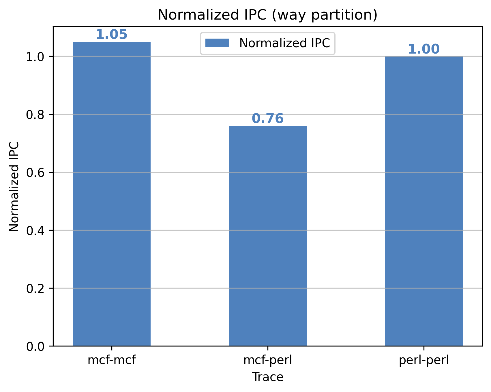
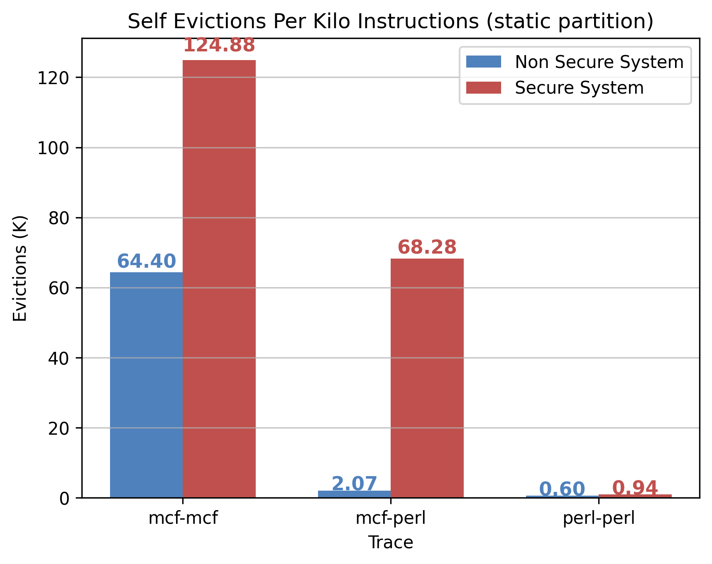
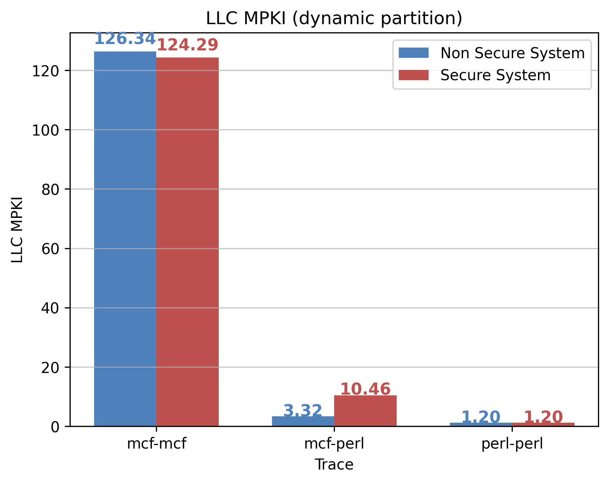
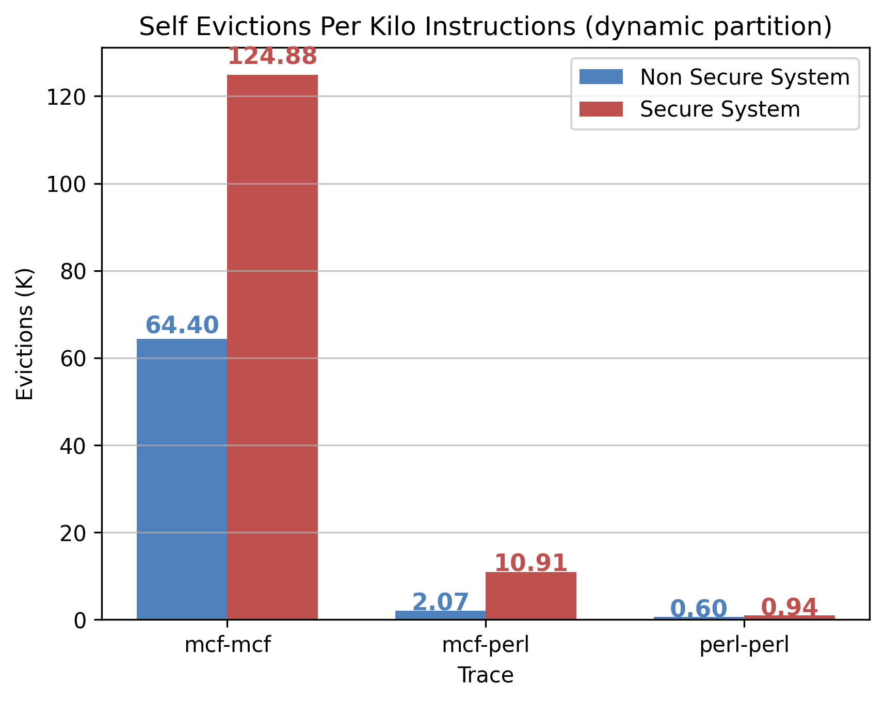
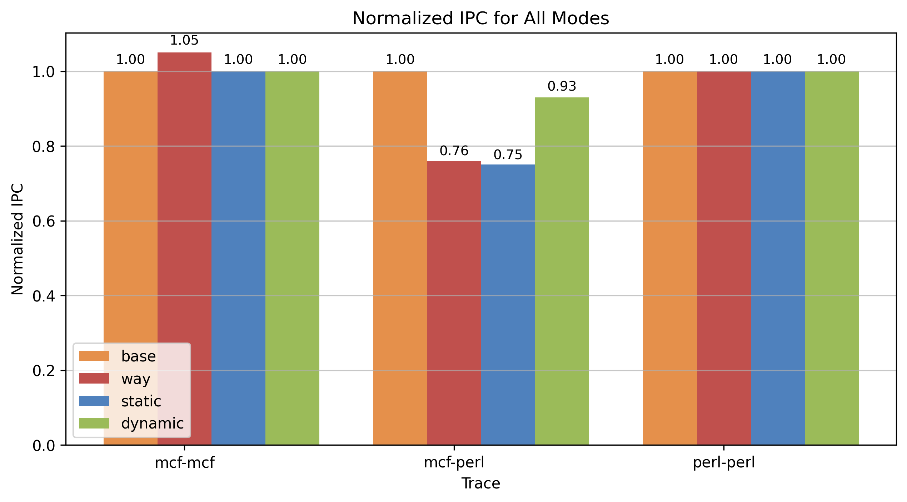
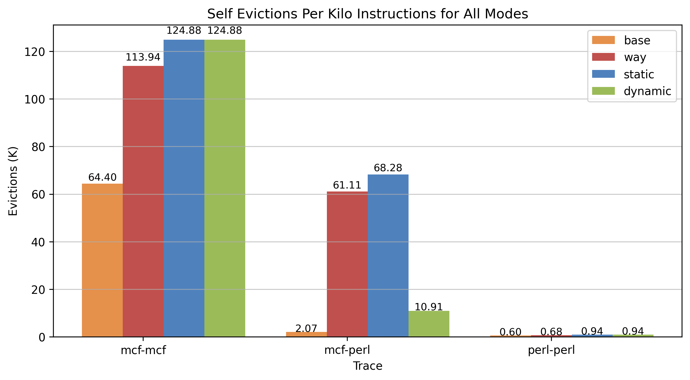

# Programming Assignment 2 Report

## CS 773: Computer Architecture for Performance and Security, Spring 2025  
**Indian Institute of Technology, Bombay**  

### Team Members:  
- **Arif Ali** (23m0822)  
- **Soumik Dutta** (23m0826)  
- **Arnab Bhakta** (23m0835)  

---

## Git Repository
[Repository Link: **[PA2](https://github.com/sammagnet7/cs773_CompArch-Perf-Security/tree/main/PA2)**]

---

### Experiment Details

#### Explanation of Table Columns:
- **Policy**: Cache partition policy used i.e. Base(No partition), Way, Static, Dynamic.
- **trace**: Workload i.e. mcf-mcf, mcf-perl, perl-perl.
- **ipc_core0**: Instructions executed per cycle by core 0.
- **ipc_core1**: Instructions executed per cycle by core 1.
- **ipc_total**: `ipc_core0 + ipc_core1`.  
- **normalized_ipc**: `new_ipc_total / base_ipc_total`
- **mpki_core0**: LLC Cache misses per 1000 instructions for core 0.
- **mpki_core1**: LLC Cache misses per 1000 instructions for core 1.
- **mpki_avg**: `(mpki_core0 + mpki_core1) / 2`.  
- **evictions_core0**: LLC Self eviction by core 0.
- **evictions_core1**: LLC Self eviction by core 1.
- **evictions_total**: `evictions_core0 + evictions_core1`.  
- **total_instruction_executed**: `50M` (core0) + `50M` (core1) = `100M`
- **EPKI (Evictions per kilo instructions)**:  `(evictions_total / total_instruction_executed) * 1000`

#### Base Data
<table border="1">
    <thead>
        <tr>
            <th rowspan="2">Policy</th>
            <th rowspan="2">Trace</th>
            <th colspan="3">IPC</th>
            <th colspan="3">MPKI</th>
            <th colspan="4">Evictions</th>
        </tr>
        <tr>
            <th>Core 0</th>
            <th>Core 1</th>
            <th>Sum</th>
            <th>Core 0</th>
            <th>Core 1</th>
            <th>Avg</th>
            <th>Core 0</th>
            <th>Core 1</th>
            <th>Sum</th>
            <th>EPKI</th>
        </tr>
    </thead>
    <tbody>
        <tr>
            <td>Base</td>
            <td>mcf-mcf</td>
            <td>{{base.mcf-mcf.ipc_core0}}</td>
            <td>{{base.mcf-mcf.ipc_core1}}</td>
            <td>{{base.mcf-mcf.ipc_total}}</td>
            <td>{{base.mcf-mcf.mpki_core0}}</td>
            <td>{{base.mcf-mcf.mpki_core1}}</td>
            <td>{{base.mcf-mcf.mpki_avg}}</td>
            <td>{{base.mcf-mcf.evictions_core0}}</td>
            <td>{{base.mcf-mcf.evictions_core1}}</td>
            <td>{{base.mcf-mcf.evictions_total}}</td>
            <td>{{base.mcf-mcf.evictions_per_k}}</td>
        </tr>
        <tr>
            <td>Base</td>
            <td>mcf-perl</td>
            <td>{{base.mcf-perl.ipc_core0}}</td>
            <td>{{base.mcf-perl.ipc_core1}}</td>
            <td>{{base.mcf-perl.ipc_total}}</td>
            <td>{{base.mcf-perl.mpki_core0}}</td>
            <td>{{base.mcf-perl.mpki_core1}}</td>
            <td>{{base.mcf-perl.mpki_avg}}</td>
            <td>{{base.mcf-perl.evictions_core0}}</td>
            <td>{{base.mcf-perl.evictions_core1}}</td>
            <td>{{base.mcf-perl.evictions_total}}</td>
            <td>{{base.mcf-perl.evictions_per_k}}</td>
        </tr>
        <tr>
            <td>Base</td>
            <td>perl-perl</td>
            <td>{{base.perl-perl.ipc_core0}}</td>
            <td>{{base.perl-perl.ipc_core1}}</td>
            <td>{{base.perl-perl.ipc_total}}</td>
            <td>{{base.perl-perl.mpki_core0}}</td>
            <td>{{base.perl-perl.mpki_core1}}</td>
            <td>{{base.perl-perl.mpki_avg}}</td>
            <td>{{base.perl-perl.evictions_core0}}</td>
            <td>{{base.perl-perl.evictions_core1}}</td>
            <td>{{base.perl-perl.evictions_total}}</td>
            <td>{{base.perl-perl.evictions_per_k}}</td>
        </tr>
    </tbody>
</table>

## Task 1A: Implementing Way Partitioning in Champsim

### Branch Name: `Way-Partitioning`

### Files Changed:
- inc/cache.h
- replacement/lru.llc_repl
- src/cache.cc

### Results:

#### Data
<table border="1">
    <thead>
        <tr>
            <th rowspan="2">Policy</th>
            <th rowspan="2">Trace</th>
            <th colspan="3">IPC</th>
            <th colspan="3">MPKI</th>
            <th colspan="4">Evictions</th>
        </tr>
        <tr>
            <th>Core 0</th>
            <th>Core 1</th>
            <th>Sum</th>
            <th>Core 0</th>
            <th>Core 1</th>
            <th>Avg</th>
            <th>Core 0</th>
            <th>Core 1</th>
            <th>Sum</th>
            <th>EPKI</th>
        </tr>
    </thead>
    <tbody>
        <tr>
            <td>Way</td>
            <td>mcf-mcf</td>
            <td>{{way.mcf-mcf.ipc_core0}}</td>
            <td>{{way.mcf-mcf.ipc_core1}}</td>
            <td>{{way.mcf-mcf.ipc_total}}</td>
            <td>{{way.mcf-mcf.mpki_core0}}</td>
            <td>{{way.mcf-mcf.mpki_core1}}</td>
            <td>{{way.mcf-mcf.mpki_avg}}</td>
            <td>{{way.mcf-mcf.evictions_core0}}</td>
            <td>{{way.mcf-mcf.evictions_core1}}</td>
            <td>{{way.mcf-mcf.evictions_total}}</td>
            <td>{{way.mcf-mcf.evictions_per_k}}</td>
        </tr>
        <tr>
            <td>Way</td>
            <td>mcf-perl</td>
            <td>{{way.mcf-perl.ipc_core0}}</td>
            <td>{{way.mcf-perl.ipc_core1}}</td>
            <td>{{way.mcf-perl.ipc_total}}</td>
            <td>{{way.mcf-perl.mpki_core0}}</td>
            <td>{{way.mcf-perl.mpki_core1}}</td>
            <td>{{way.mcf-perl.mpki_avg}}</td>
            <td>{{way.mcf-perl.evictions_core0}}</td>
            <td>{{way.mcf-perl.evictions_core1}}</td>
            <td>{{way.mcf-perl.evictions_total}}</td>
            <td>{{way.mcf-perl.evictions_per_k}}</td>
        </tr>
        <tr>
            <td>Way</td>
            <td>perl-perl</td>
            <td>{{way.perl-perl.ipc_core0}}</td>
            <td>{{way.perl-perl.ipc_core1}}</td>
            <td>{{way.perl-perl.ipc_total}}</td>
            <td>{{way.perl-perl.mpki_core0}}</td>
            <td>{{way.perl-perl.mpki_core1}}</td>
            <td>{{way.perl-perl.mpki_avg}}</td>
            <td>{{way.perl-perl.evictions_core0}}</td>
            <td>{{way.perl-perl.evictions_core1}}</td>
            <td>{{way.perl-perl.evictions_total}}</td>
            <td>{{way.perl-perl.evictions_per_k}}</td>
        </tr>
    </tbody>
</table>

#### Normalized IPC

#### LLC MPKI Comparison

#### Self-Evictions per Kilo Instructions

---

## Task 2A: Static Set Partitioning

### Branch Name: `Static-Set-partitioning`

### Files Changed:
- inc/cache.h
- src/cache.cc
- src/page_table_walker.cc
- src/main.cc

### Results:

#### Data
<table border="1">
    <thead>
        <tr>
            <th rowspan="2">Policy</th>
            <th rowspan="2">Trace</th>
            <th colspan="3">IPC</th>
            <th colspan="3">MPKI</th>
            <th colspan="4">Evictions</th>
        </tr>
        <tr>
            <th>Core 0</th>
            <th>Core 1</th>
            <th>Sum</th>
            <th>Core 0</th>
            <th>Core 1</th>
            <th>Avg</th>
            <th>Core 0</th>
            <th>Core 1</th>
            <th>Sum</th>
            <th>EPKI</th>
        </tr>
    </thead>
    <tbody>
        <tr>
            <td>Static</td>
            <td>mcf-mcf</td>
            <td>{{static.mcf-mcf.ipc_core0}}</td>
            <td>{{static.mcf-mcf.ipc_core1}}</td>
            <td>{{static.mcf-mcf.ipc_total}}</td>
            <td>{{static.mcf-mcf.mpki_core0}}</td>
            <td>{{static.mcf-mcf.mpki_core1}}</td>
            <td>{{static.mcf-mcf.mpki_avg}}</td>
            <td>{{static.mcf-mcf.evictions_core0}}</td>
            <td>{{static.mcf-mcf.evictions_core1}}</td>
            <td>{{static.mcf-mcf.evictions_total}}</td>
            <td>{{static.mcf-mcf.evictions_per_k}}</td>
        </tr>
        <tr>
            <td>Static</td>
            <td>mcf-perl</td>
            <td>{{static.mcf-perl.ipc_core0}}</td>
            <td>{{static.mcf-perl.ipc_core1}}</td>
            <td>{{static.mcf-perl.ipc_total}}</td>
            <td>{{static.mcf-perl.mpki_core0}}</td>
            <td>{{static.mcf-perl.mpki_core1}}</td>
            <td>{{static.mcf-perl.mpki_avg}}</td>
            <td>{{static.mcf-perl.evictions_core0}}</td>
            <td>{{static.mcf-perl.evictions_core1}}</td>
            <td>{{static.mcf-perl.evictions_total}}</td>
            <td>{{static.mcf-perl.evictions_per_k}}</td>
        </tr>
        <tr>
            <td>Static</td>
            <td>perl-perl</td>
            <td>{{static.perl-perl.ipc_core0}}</td>
            <td>{{static.perl-perl.ipc_core1}}</td>
            <td>{{static.perl-perl.ipc_total}}</td>
            <td>{{static.perl-perl.mpki_core0}}</td>
            <td>{{static.perl-perl.mpki_core1}}</td>
            <td>{{static.perl-perl.mpki_avg}}</td>
            <td>{{static.perl-perl.evictions_core0}}</td>
            <td>{{static.perl-perl.evictions_core1}}</td>
            <td>{{static.perl-perl.evictions_total}}</td>
            <td>{{static.perl-perl.evictions_per_k}}</td>
        </tr>
    </tbody>
</table>

#### Normalized Speedup

#### LLC MPKI Comparison

#### Self-Evictions per Kilo Instructions

---

## Task 2B: Dynamic Set Partitioning

### Branch Name: `Dynamic-set-partitioning`

### Files Changed:
- inc/cache.h
- src/cache.cc
- src/main.cc
- src/page_table_walker.cc

### Results:

#### Data
<table border="1">
    <thead>
        <tr>
            <th rowspan="2">Policy</th>
            <th rowspan="2">Trace</th>
            <th colspan="3">IPC</th>
            <th colspan="3">MPKI</th>
            <th colspan="4">Evictions</th>
        </tr>
        <tr>
            <th>Core 0</th>
            <th>Core 1</th>
            <th>Sum</th>
            <th>Core 0</th>
            <th>Core 1</th>
            <th>Avg</th>
            <th>Core 0</th>
            <th>Core 1</th>
            <th>Sum</th>
            <th>EPKI</th>
        </tr>
    </thead>
    <tbody>
        <tr>
            <td>Dynamic</td>
            <td>mcf-mcf</td>
            <td>{{dynamic.mcf-mcf.ipc_core0}}</td>
            <td>{{dynamic.mcf-mcf.ipc_core1}}</td>
            <td>{{dynamic.mcf-mcf.ipc_total}}</td>
            <td>{{dynamic.mcf-mcf.mpki_core0}}</td>
            <td>{{dynamic.mcf-mcf.mpki_core1}}</td>
            <td>{{dynamic.mcf-mcf.mpki_avg}}</td>
            <td>{{dynamic.mcf-mcf.evictions_core0}}</td>
            <td>{{dynamic.mcf-mcf.evictions_core1}}</td>
            <td>{{dynamic.mcf-mcf.evictions_total}}</td>
            <td>{{dynamic.mcf-mcf.evictions_per_k}}</td>
        </tr>
        <tr>
            <td>Dynamic</td>
            <td>mcf-perl</td>
            <td>{{dynamic.mcf-perl.ipc_core0}}</td>
            <td>{{dynamic.mcf-perl.ipc_core1}}</td>
            <td>{{dynamic.mcf-perl.ipc_total}}</td>
            <td>{{dynamic.mcf-perl.mpki_core0}}</td>
            <td>{{dynamic.mcf-perl.mpki_core1}}</td>
            <td>{{dynamic.mcf-perl.mpki_avg}}</td>
            <td>{{dynamic.mcf-perl.evictions_core0}}</td>
            <td>{{dynamic.mcf-perl.evictions_core1}}</td>
            <td>{{dynamic.mcf-perl.evictions_total}}</td>
            <td>{{dynamic.mcf-perl.evictions_per_k}}</td>
        </tr>
        <tr>
            <td>Dynamic</td>
            <td>perl-perl</td>
            <td>{{dynamic.perl-perl.ipc_core0}}</td>
            <td>{{dynamic.perl-perl.ipc_core1}}</td>
            <td>{{dynamic.perl-perl.ipc_total}}</td>
            <td>{{dynamic.perl-perl.mpki_core0}}</td>
            <td>{{dynamic.perl-perl.mpki_core1}}</td>
            <td>{{dynamic.perl-perl.mpki_avg}}</td>
            <td>{{dynamic.perl-perl.evictions_core0}}</td>
            <td>{{dynamic.perl-perl.evictions_core1}}</td>
            <td>{{dynamic.perl-perl.evictions_total}}</td>
            <td>{{dynamic.perl-perl.evictions_per_k}}</td>
        </tr>
    </tbody>
</table>

#### Normalized Speedup

#### LLC MPKI Comparison

#### Self-Evictions per Kilo Instructions

---

## Conclusion
#### Data
<table border="1">
    <thead>
        <tr>
            <th rowspan="2">Trace</th>
            <th colspan="4">Normalized IPC</th>
            <th colspan="4">LLC MPKI</th>
            <th colspan="4">Self Evictions Per Kilo Instructions</th>
        </tr>
        <tr>
            <th>Base</th>
            <th>Way</th>
            <th>Static</th>
            <th>Dynamic</th>
            <th>Base</th>
            <th>Way</th>
            <th>Static</th>
            <th>Dynamic</th>
            <th>Base</th>
            <th>Way</th>
            <th>Static</th>
            <th>Dynamic</th>
        </tr>
    </thead>
    <tbody>
        <tr>
            <td>mcf-mcf</td>
            <td>{{base.mcf-mcf.normalized_ipc}}</td>
            <td>{{way.mcf-mcf.normalized_ipc}}</td>
            <td>{{static.mcf-mcf.normalized_ipc}}</td>
            <td>{{dynamic.mcf-mcf.normalized_ipc}}</td>
            <td>{{base.mcf-mcf.new_mpki}}</td>
            <td>{{way.mcf-mcf.new_mpki}}</td>
            <td>{{static.mcf-mcf.new_mpki}}</td>
            <td>{{dynamic.mcf-mcf.new_mpki}}</td>
            <td>{{base.mcf-mcf.new_evictions}}</td>
            <td>{{way.mcf-mcf.new_evictions}}</td>
            <td>{{static.mcf-mcf.new_evictions}}</td>
            <td>{{dynamic.mcf-mcf.new_evictions}}</td>
        </tr>
        <tr>
            <td>mcf-perl</td>
            <td>{{base.mcf-perl.normalized_ipc}}</td>
            <td>{{way.mcf-perl.normalized_ipc}}</td>
            <td>{{static.mcf-perl.normalized_ipc}}</td>
            <td>{{dynamic.mcf-perl.normalized_ipc}}</td>
            <td>{{base.mcf-perl.new_mpki}}</td>
            <td>{{way.mcf-perl.new_mpki}}</td>
            <td>{{static.mcf-perl.new_mpki}}</td>
            <td>{{dynamic.mcf-perl.new_mpki}}</td>
            <td>{{base.mcf-perl.new_evictions}}</td>
            <td>{{way.mcf-perl.new_evictions}}</td>
            <td>{{static.mcf-perl.new_evictions}}</td>
            <td>{{dynamic.mcf-perl.new_evictions}}</td>
        </tr>
        <tr>
            <td>perl-perl</td>
            <td>{{base.perl-perl.normalized_ipc}}</td>
            <td>{{way.perl-perl.normalized_ipc}}</td>
            <td>{{static.perl-perl.normalized_ipc}}</td>
            <td>{{dynamic.perl-perl.normalized_ipc}}</td>
            <td>{{base.perl-perl.new_mpki}}</td>
            <td>{{way.perl-perl.new_mpki}}</td>
            <td>{{static.perl-perl.new_mpki}}</td>
            <td>{{dynamic.perl-perl.new_mpki}}</td>
            <td>{{base.perl-perl.new_evictions}}</td>
            <td>{{way.perl-perl.new_evictions}}</td>
            <td>{{static.perl-perl.new_evictions}}</td>
            <td>{{dynamic.perl-perl.new_evictions}}</td>
        </tr>
    </tbody>
</table>

#### Normalized Speedup

#### LLC MPKI Comparison

#### Self-Evictions per Kilo Instructions
