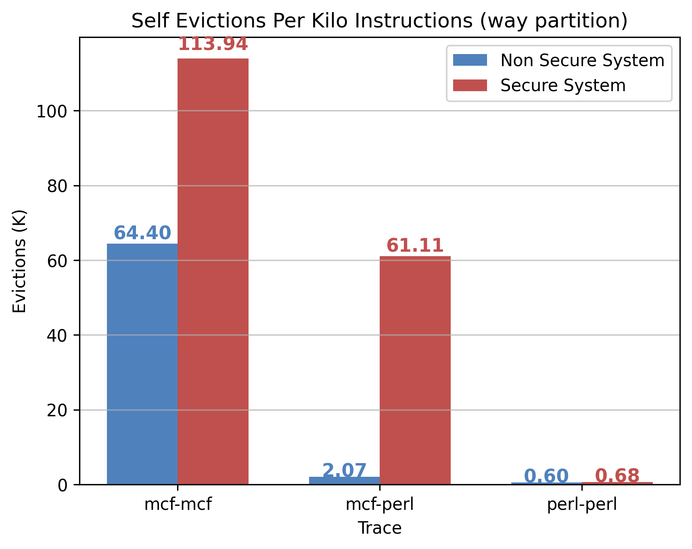
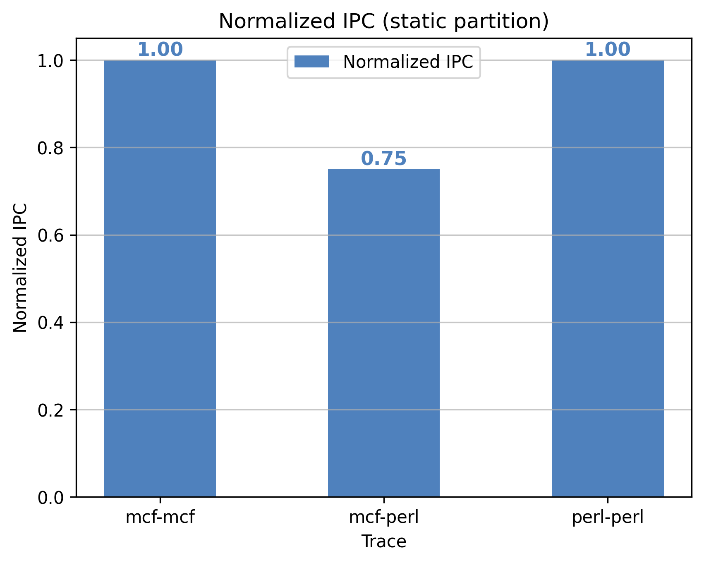

# Programming Assignment 2 Report

## CS 773: Computer Architecture for Performance and Security, Spring 2025  
**Indian Institute of Technology, Bombay**  

### Team Members:  
- **Arif Ali** (23m0822)  
- **Soumik Dutta** (23m0826)  
- **Arnab Bhakta** (23m0835)  

---

## Git Repository
[Repository Link: **[PA2](https://github.com/sammagnet7/cs773_CompArch-Perf-Security/tree/main/PA2)**]

---

### Experiment Details

#### Explanation of Table Columns:
- **mode**: Cache management mode used in the experiment (Way, Static, Dynamic). Directly obtained.  
- **trace**: Workload combination used (e.g., mcf-mcf, mcf-perl, perl-perl). Directly obtained.  
- **ipc_core0**: Instructions executed per cycle by core 0. Directly obtained.  
- **ipc_core1**: Instructions executed per cycle by core 1. Directly obtained.  
- **ipc_total**: Total instructions per cycle across both cores. Formula: `ipc_total = ipc_core0 + ipc_core1`.  
- **normalized_ipc**: Normalized ipc compared to base. Formulat: `normalized_ipc = new_ipc_total / base_ipc_total`
- **mpki_core0**: Cache misses per 1000 instructions for core 0. Directly obtained.  
- **mpki_core1**: Cache misses per 1000 instructions for core 1. Directly obtained.  
- **mpki_avg**: Average cache misses per 1000 instructions. Formula: `mpki_avg = (mpki_core0 + mpki_core1) / 2`.  
- **evictions_core0**: Cache blocks evicted from core 0’s cache. Directly obtained.  
- **evictions_core1**: Cache blocks evicted from core 1’s cache. Directly obtained.  
- **evictions_total**: Total cache evictions across both cores. Formula: `evictions_total = evictions_core0 + evictions_core1`.  
- **evictions_per_k**: Cache blocks evicted per 1000 instructions. Formula: `evictions_per_k = (evictions_total / total_instruction_executed) * 1000`, where `total_instruction_executed = 50M`.  

#### Base Data
| mode  | trace     | ipc_core0   | ipc_core1   | ipc_total   | mpki_core0   | mpki_core1   | mpki_avg   | evictions_core0   | evictions_core1   | evictions_total   | evictions_per_k   |
|-------|----------|------------|------------|------------|------------|------------|----------|------------------|------------------|------------------|------------------|
| base  | mcf-mcf  | {{base.mcf-mcf.ipc_core0}}  | {{base.mcf-mcf.ipc_core1}}  | {{base.mcf-mcf.ipc_total}}  | {{base.mcf-mcf.mpki_core0}}  | {{base.mcf-mcf.mpki_core1}}  | {{base.mcf-mcf.mpki_avg}}  | {{base.mcf-mcf.evictions_core0}}  | {{base.mcf-mcf.evictions_core1}}  | {{base.mcf-mcf.evictions_total}}  | {{base.mcf-mcf.evictions_per_k}}  |
| base  | mcf-perl | {{base.mcf-perl.ipc_core0}} | {{base.mcf-perl.ipc_core1}} | {{base.mcf-perl.ipc_total}} | {{base.mcf-perl.mpki_core0}} | {{base.mcf-perl.mpki_core1}} | {{base.mcf-perl.mpki_avg}} | {{base.mcf-perl.evictions_core0}} | {{base.mcf-perl.evictions_core1}} | {{base.mcf-perl.evictions_total}} | {{base.mcf-perl.evictions_per_k}} |
| base  | perl-perl| {{base.perl-perl.ipc_core0}} | {{base.perl-perl.ipc_core1}} | {{base.perl-perl.ipc_total}} | {{base.perl-perl.mpki_core0}} | {{base.perl-perl.mpki_core1}} | {{base.perl-perl.mpki_avg}} | {{base.perl-perl.evictions_core0}} | {{base.perl-perl.evictions_core1}} | {{base.perl-perl.evictions_total}} | {{base.perl-perl.evictions_per_k}} |

## Task 1A: Implementing Way Partitioning in Champsim

### Branch Name: `Way-Partitioning`

### Files Changed:
- inc/cache.h
- replacement/lru.llc_repl
- src/cache.cc

### Results:

#### Data
| mode  | trace     | ipc_core0   | ipc_core1   | ipc_total   | mpki_core0   | mpki_core1   | mpki_avg   | evictions_core0   | evictions_core1   | evictions_total   | evictions_per_k   |
|-------|----------|------------|------------|------------|------------|------------|----------|------------------|------------------|------------------|------------------|
| Way  | mcf-mcf  | {{way.mcf-mcf.ipc_core0}}  | {{way.mcf-mcf.ipc_core1}}  | {{way.mcf-mcf.ipc_total}}  | {{way.mcf-mcf.mpki_core0}}  | {{way.mcf-mcf.mpki_core1}}  | {{way.mcf-mcf.mpki_avg}}  | {{way.mcf-mcf.evictions_core0}}  | {{way.mcf-mcf.evictions_core1}}  | {{way.mcf-mcf.evictions_total}}  | {{way.mcf-mcf.evictions_per_k}}  |
| Way  | mcf-perl | {{way.mcf-perl.ipc_core0}} | {{way.mcf-perl.ipc_core1}} | {{way.mcf-perl.ipc_total}} | {{way.mcf-perl.mpki_core0}} | {{way.mcf-perl.mpki_core1}} | {{way.mcf-perl.mpki_avg}} | {{way.mcf-perl.evictions_core0}} | {{way.mcf-perl.evictions_core1}} | {{way.mcf-perl.evictions_total}} | {{way.mcf-perl.evictions_per_k}} |
| Way  | perl-perl| {{way.perl-perl.ipc_core0}} | {{way.perl-perl.ipc_core1}} | {{way.perl-perl.ipc_total}} | {{way.perl-perl.mpki_core0}} | {{way.perl-perl.mpki_core1}} | {{way.perl-perl.mpki_avg}} | {{way.perl-perl.evictions_core0}} | {{way.perl-perl.evictions_core1}} | {{way.perl-perl.evictions_total}} | {{way.perl-perl.evictions_per_k}} |

#### Normalized IPC

#### LLC MPKI Comparison

#### Self-Evictions per Kilo Instructions

---

## Task 2A: Static Set Partitioning (Rang-De-Basanti)

### Branch Name: `Static-Set-partitioning`

### Files Changed:
- inc/cache.h
- src/cache.cc
- src/page_table_walker.cc
- src/main.cc

### Results:

#### Data
| mode  | trace     | ipc_core0   | ipc_core1   | ipc_total   | mpki_core0   | mpki_core1   | mpki_avg   | evictions_core0   | evictions_core1   | evictions_total   | evictions_per_k   |
|-------|----------|------------|------------|------------|------------|------------|----------|------------------|------------------|------------------|------------------|
| Static  | mcf-mcf  | {{static.mcf-mcf.ipc_core0}}  | {{static.mcf-mcf.ipc_core1}}  | {{static.mcf-mcf.ipc_total}}  | {{static.mcf-mcf.mpki_core0}}  | {{static.mcf-mcf.mpki_core1}}  | {{static.mcf-mcf.mpki_avg}}  | {{static.mcf-mcf.evictions_core0}}  | {{static.mcf-mcf.evictions_core1}}  | {{static.mcf-mcf.evictions_total}}  | {{static.mcf-mcf.evictions_per_k}}  |
| static  | mcf-perl | {{static.mcf-perl.ipc_core0}} | {{static.mcf-perl.ipc_core1}} | {{static.mcf-perl.ipc_total}} | {{static.mcf-perl.mpki_core0}} | {{static.mcf-perl.mpki_core1}} | {{static.mcf-perl.mpki_avg}} | {{static.mcf-perl.evictions_core0}} | {{static.mcf-perl.evictions_core1}} | {{static.mcf-perl.evictions_total}} | {{static.mcf-perl.evictions_per_k}} |
| static  | perl-perl| {{static.perl-perl.ipc_core0}} | {{static.perl-perl.ipc_core1}} | {{static.perl-perl.ipc_total}} | {{static.perl-perl.mpki_core0}} | {{static.perl-perl.mpki_core1}} | {{static.perl-perl.mpki_avg}} | {{static.perl-perl.evictions_core0}} | {{static.perl-perl.evictions_core1}} | {{static.perl-perl.evictions_total}} | {{static.perl-perl.evictions_per_k}} |

#### Normalized Speedup

#### LLC MPKI Comparison

#### Self-Evictions per Kilo Instructions

---

## Task 2B: Dynamic Set Partitioning (Tumse Na Ho Payega!)

### Branch Name: `Dynamic-set-partitioning`

### Files Changed:
- inc/cache.h
- src/cache.cc
- src/main.cc
- src/page_table_walker.cc

### Results:

#### Data
| mode  | trace     | ipc_core0   | ipc_core1   | ipc_total   | mpki_core0   | mpki_core1   | mpki_avg   | evictions_core0   | evictions_core1   | evictions_total   | evictions_per_k   |
|-------|----------|------------|------------|------------|------------|------------|----------|------------------|------------------|------------------|------------------|
| dynamic  | mcf-mcf  | {{dynamic.mcf-mcf.ipc_core0}}  | {{dynamic.mcf-mcf.ipc_core1}}  | {{dynamic.mcf-mcf.ipc_total}}  | {{dynamic.mcf-mcf.mpki_core0}}  | {{dynamic.mcf-mcf.mpki_core1}}  | {{dynamic.mcf-mcf.mpki_avg}}  | {{dynamic.mcf-mcf.evictions_core0}}  | {{dynamic.mcf-mcf.evictions_core1}}  | {{dynamic.mcf-mcf.evictions_total}}  | {{dynamic.mcf-mcf.evictions_per_k}}  |
| dynamic  | mcf-perl | {{dynamic.mcf-perl.ipc_core0}} | {{dynamic.mcf-perl.ipc_core1}} | {{dynamic.mcf-perl.ipc_total}} | {{dynamic.mcf-perl.mpki_core0}} | {{dynamic.mcf-perl.mpki_core1}} | {{dynamic.mcf-perl.mpki_avg}} | {{dynamic.mcf-perl.evictions_core0}} | {{dynamic.mcf-perl.evictions_core1}} | {{dynamic.mcf-perl.evictions_total}} | {{dynamic.mcf-perl.evictions_per_k}} |
| dynamic  | perl-perl| {{dynamic.perl-perl.ipc_core0}} | {{dynamic.perl-perl.ipc_core1}} | {{dynamic.perl-perl.ipc_total}} | {{dynamic.perl-perl.mpki_core0}} | {{dynamic.perl-perl.mpki_core1}} | {{dynamic.perl-perl.mpki_avg}} | {{dynamic.perl-perl.evictions_core0}} | {{dynamic.perl-perl.evictions_core1}} | {{dynamic.perl-perl.evictions_total}} | {{dynamic.perl-perl.evictions_per_k}} |

#### Normalized Speedup

#### LLC MPKI Comparison

#### Self-Evictions per Kilo Instructions

---

## Conclusion

